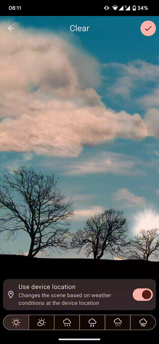
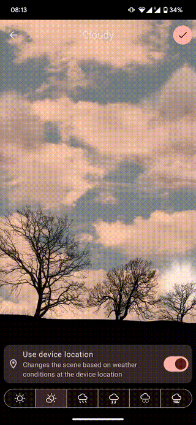
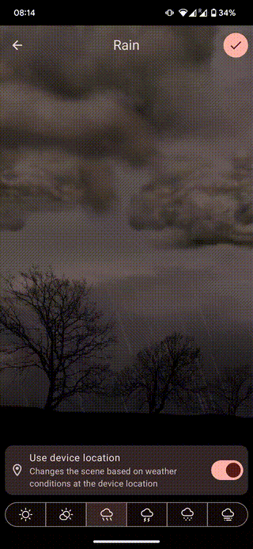
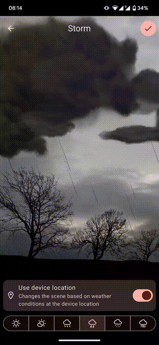
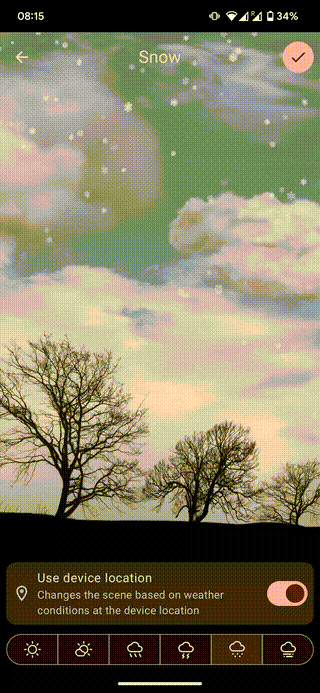
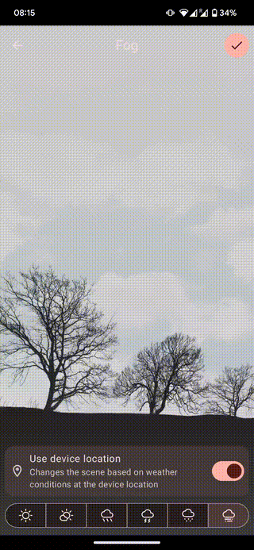

# android-weather-tree-live-wallpaper
This is a resurrected project of `Weather Wallpaper` (`com.hm.weather`) originally developed by `yitiaocaiHM`, where you can still find its APK over the Internet.

Partially migrated to a modern stack (WIP):
- Kotlin
- KotlinX Serialzation JSON
- Hilt
- AndroixX framework:
  - Compose
  - Material 3
  - DataStore
  - WorkManager
- Retrofit
- And using Norway's [MET Weather API](https://api.met.no/) for fetching weather conditions

## Scenes
|                                  |                                |                            |
|----------------------------------|--------------------------------|----------------------------|
|  |  |  |
|      |     |    |

This project is a slowing migration to a modern setup as an attempt to keep it up to date with the Android ecosystem and keep it functional.

> [!NOTE]
> I kept this to run it on my own devices, just because I liked it very much and it suddenly disappeared from Google Play.
> I do not offer any guarantee or maintenance support rather than for my own needs for it.
